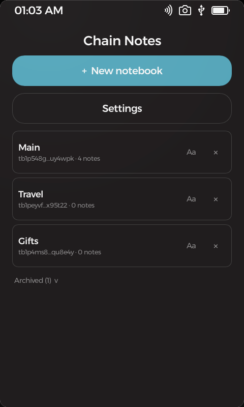
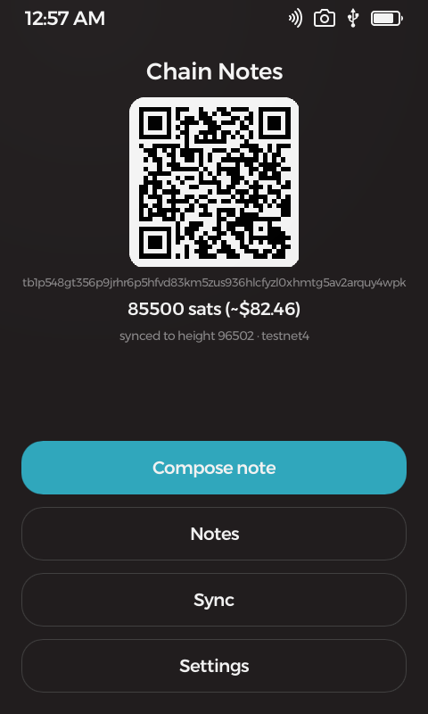
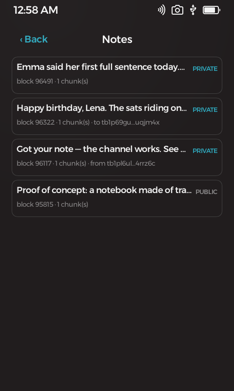
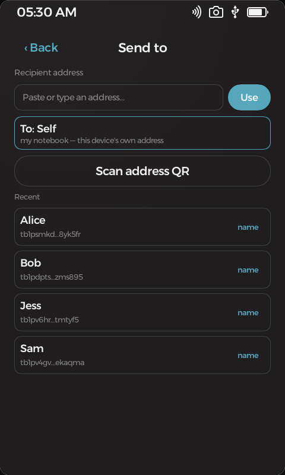
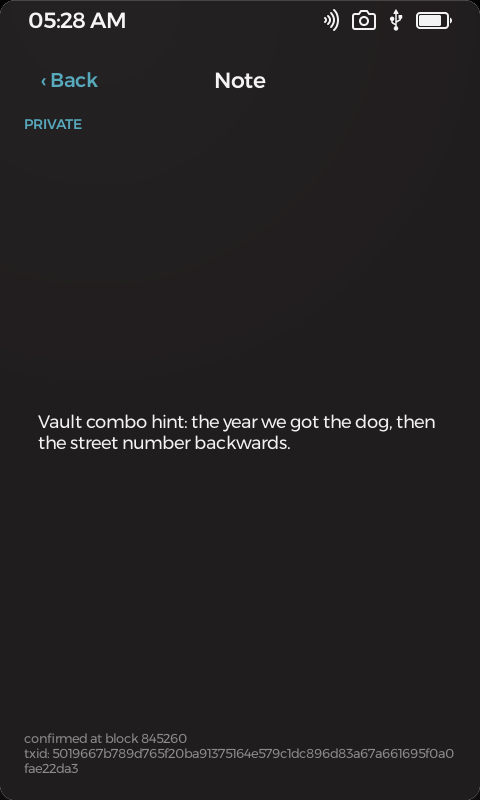
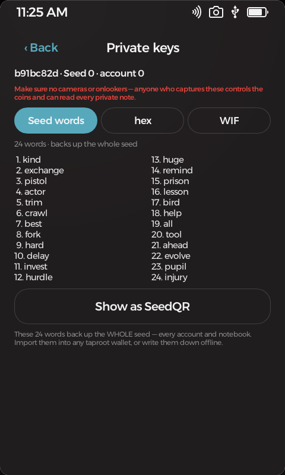
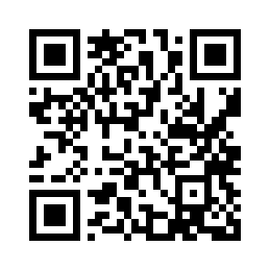

#  Chain Notes

**Bitcoin · Notes** — personal notes on the bitcoin blockchain, written from a device that has no network on purpose.

Compose a note on your Passport Prime, seal it with a key only your seed can re-derive — or leave it deliberately public — and the app builds and signs a real bitcoin transaction carrying the note. An online companion page broadcasts it and scans the chain; the device and the companion exchange nothing but files and QR codes. Your address history *is* the notebook: wipe the device, restore your seed, rescan the chain — every note comes back, private ones decrypted, with nothing stored anywhere else.

Keep as many **notebooks** as you like — each is its own address, derived from the same device seed, with its own notes, balance, and name. Sort a life's worth of notes: one for gifts, one for a project, one you'll archive when it's done.

<p align="center">
  
  &nbsp;
  
  &nbsp;
  
</p>

## Features

- **Notebooks** — keep separate notebooks, each a distinct address derived from your one device seed, each with its own notes, balance, and name; create or archive them as your life needs, and filter a notebook's notes by who sent them.
- **A backup you can read** — your notebooks derive from a 24-word recovery phrase the device shows on demand, as words or a SeedQR. Write it down once and your funds restore in *any* bitcoin wallet and your notes in this app — no Passport required. Keep separate **accounts** for separate lives, and if a phrase is ever exposed, switch to a fresh one.
- **Every key, when you need it** — a Settings *Dangerous area* reveals your keys grouped by risk: **public** (account xpub + a `tr()` descriptor — watch-only, safe to share) and **private** (recovery words, and any notebook's hex/WIF), each scannable as a QR to import elsewhere. The device deliberately never shows a whole-account private key — the 24 words already restore everything.
- **Public or private** — private notes are sealed with modern authenticated encryption before they ever leave the device; public notes are plain text for the world to read.
- **Notes to other people** — composing starts at a **contacts picker**: yourself, recent addresses (nameable), a QR scan, or manual entry. Directed notes reach any taproot address like unstoppable, uncensorable mail; private directed notes can be read by exactly two devices — yours and theirs — and both can recover them from bare chain data after a wipe.
- **A gift inside** — directed notes can carry a chosen amount of sats to the recipient, from the minimum dust up to whatever you like.
- **Live cost while you type** — the compose screen re-prices on every keystroke with economy/normal/fast fee tiers or a custom rate, and the estimate is byte-exact against the transaction that actually gets signed.
- **Sync without a cable** — bundles come in by animated QR straight to the device camera; signed transactions go out as a QR the companion scans with your webcam. Files and the Airlock volume cover the big transfers.
- **Coins, sweep & consolidate** — a wallet-wide Coins screen across every notebook, one-tap consolidate into a single coin, and a guided sweep that empties the whole wallet to any address you pick — all one transaction, all signed on-device.
- **Every network** — mainnet, testnet4, signet, and regtest as one wallet-wide setting; each notebook keeps a separate ledger per chain, and the relay policy is verified live on testnet4.

<p align="center">
  
  &nbsp;
  
  &nbsp;
  
</p>

## The companion

**Hosted at [objsal.github.io/chain-notes-companion](https://objsal.github.io/chain-notes-companion/)** — the online half, and no more than that: it builds sync bundles from public chain data and broadcasts what the device signed. It never sees a key.

- **Sync & broadcast** (`index.html`) — builds bundles (shown as a file or a static/animated QR) and broadcasts the device's transactions, via mempool.space or your own local node.
- **Read-only viewer** (`viewer.html`) — renders any address's on-chain notes in the browser: public notes as text, private ones as sealed placeholders. Decryption stays on the device by design.
- **Note permalinks** (`note.html`) — share a link to a single note.

## Get it running

With the Foundation SDK installed, build and launch in the simulator with:

```bash
foundation sim
```

## Learn more

- [THIRD-PARTY.md](THIRD-PARTY.md) — libraries this app is built on
- `../PLAN-chain-notes.md` — the design document (workspace repo)

## Support

If this app is useful to you, a small bitcoin donation is always appreciated — entirely optional.

<div align="center">



**`bc1qrfagrsfrm8erdsmrku3fgq5yc573zyp2q3uje8`**

</div>

Donations help cover development costs and keep more open-source bitcoin tools coming. No VC funding, no ads, no tracking.

## License & disclaimer

Licensed under the GNU General Public License v3.0 or later — see [COPYING](COPYING). Sections 15–17 of that license disclaim all warranty and limit liability; the notes below restate that in plain language.

This is experimental software and it has **not been independently audited**.
It is provided **"as is", without warranty of any kind**, express or implied,
including but not limited to the warranties of merchantability, fitness for a
particular purpose, and non-infringement.

**Use it at your own risk.** To the maximum extent permitted by law, in no
event shall the authors, copyright holders, or contributors be liable for any
claim, damages, or other liability — including, without limitation,
**loss of bitcoin or other funds, loss of keys or seeds, or loss of data** — whether in an action of contract, tort, or
otherwise, arising from, out of, or in connection with this software or its
use.

Nothing in this project is financial, investment, legal, or tax advice. You
are solely responsible for verifying addresses, amounts, fees, and backups
before moving funds, and for complying with the laws of your jurisdiction.
Test on test networks, or with amounts you can afford to lose, first.

Everything this app writes to the blockchain is **public and permanent** — including the transaction metadata around encrypted notes (addresses, timing, amounts). Notes cannot be edited or deleted once broadcast. Do not put anything on-chain you may later need gone.
