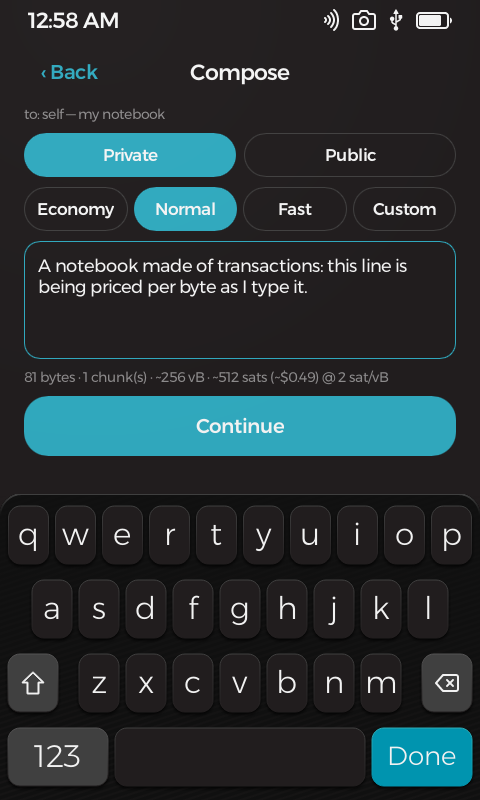

#  Chain Notes

**Bitcoin · Notes** — personal notes on the bitcoin blockchain, written from a device that has no network on purpose.

Compose a note on your Passport Prime, seal it with a key only your device seed can re-derive — or leave it deliberately public — and the app builds and signs a real bitcoin transaction carrying the note. An online companion page broadcasts it and scans the chain; the device and the companion exchange nothing but files and QR codes. Your address history *is* the notebook: wipe the device, restore your seed, rescan the chain — every note comes back, private ones decrypted, with nothing stored anywhere else.

<p align="center">
  
  &nbsp;
  
  &nbsp;
  
</p>

## Features

- **Public or private** — private notes are sealed with modern authenticated encryption before they ever leave the device; public notes are plain text for the world to read.
- **Notes to other people** — composing starts at a **contacts picker**: yourself, recent addresses (nameable), a QR scan, or manual entry. Directed notes reach any taproot address like unstoppable, uncensorable mail; private directed notes can be read by exactly two devices — yours and theirs — and both can recover them from bare chain data after a wipe.
- **A gift inside** — directed notes can carry a chosen amount of sats to the recipient, from the minimum dust up to whatever you like.
- **Live cost while you type** — the compose screen re-prices on every keystroke with economy/normal/fast fee tiers or a custom rate, and the estimate is byte-exact against the transaction that actually gets signed.
- **Sync without a cable** — bundles come in by animated QR straight to the device camera; signed transactions go out as a QR the companion scans with your webcam. Files and the Airlock volume cover the big transfers.
- **Coins, sweep & consolidate** — a viewer-first Coins screen, one-tap consolidate, and a guided sweep flow that sends everything to any address you pick, all signed on-device.
- **Every network** — mainnet, testnet4, signet, and regtest, with the relay policy verified live on testnet4.

<p align="center">
  
  &nbsp;
  
</p>

## The companion

**Hosted at [objsal.github.io/chain-notes-companion](https://objsal.github.io/chain-notes-companion/)** — the online half, and no more than that: it builds sync bundles from public chain data and broadcasts what the device signed. It never sees a key.

- **Sync & broadcast** (`index.html`) — builds bundles (shown as a file or a static/animated QR) and broadcasts the device's transactions, via mempool.space or your own local node.
- **Read-only viewer** (`viewer.html`) — renders any address's on-chain notes in the browser: public notes as text, private ones as sealed placeholders. Decryption stays on the device by design.
- **Note permalinks** (`note.html`) — share a link to a single note.

## Honest caveats

- Every note costs a real transaction fee and lives on a public blockchain forever. Private notes hide content — not existence, size, or timing.
- A directed note publicly and permanently links the sender and recipient addresses on-chain.
- Experimental software that signs real spends: Foundation asks wallet-adjacent apps to pass their security review (hello@foundation.xyz) before mainnet use.

## Get it running

With the Foundation SDK installed, build and launch in the simulator with:

```bash
foundation sim
```

See **[DEVELOPMENT.md](DEVELOPMENT.md)** for environment setup, the protocol, testing (including the full regtest pipeline), and the companion's internals.

## Learn more

- [DEVELOPMENT.md](DEVELOPMENT.md) — building, protocol internals, testing, companion architecture
- [THIRD-PARTY.md](THIRD-PARTY.md) — libraries this app is built on
- [NOTES.md](NOTES.md) — verified results and platform gotchas
- `../PLAN-chain-notes.md` — the design document (workspace repo)

## License & disclaimer

Licensed under the GNU General Public License v3.0 or later — see [COPYING](COPYING). Sections 15–17 of that license disclaim all warranty and limit liability; the notes below restate that in plain language.

This is experimental software and it has **not been independently audited**.
It is provided **"as is", without warranty of any kind**, express or implied,
including but not limited to the warranties of merchantability, fitness for a
particular purpose, and non-infringement.

**Use it at your own risk.** To the maximum extent permitted by law, in no
event shall the authors, copyright holders, or contributors be liable for any
claim, damages, or other liability — including, without limitation,
**loss of bitcoin or other funds, loss of keys or seeds, or loss of data** — whether in an action of contract, tort, or
otherwise, arising from, out of, or in connection with this software or its
use.

Nothing in this project is financial, investment, legal, or tax advice. You
are solely responsible for verifying addresses, amounts, fees, and backups
before moving funds, and for complying with the laws of your jurisdiction.
Test on test networks, or with amounts you can afford to lose, first.

Everything this app writes to the blockchain is **public and permanent** — including the transaction metadata around encrypted notes (addresses, timing, amounts). Notes cannot be edited or deleted once broadcast. Do not put anything on-chain you may later need gone.
