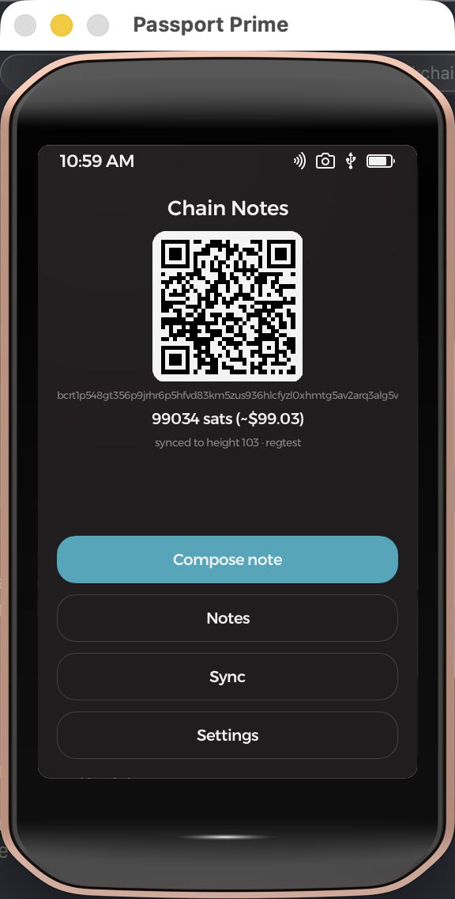
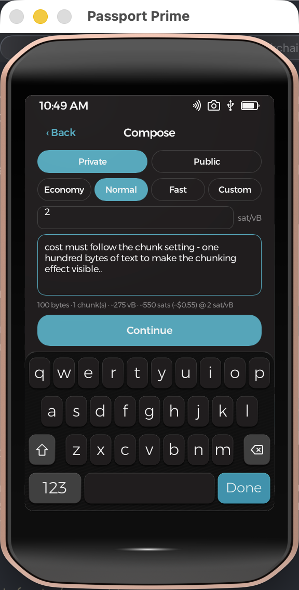
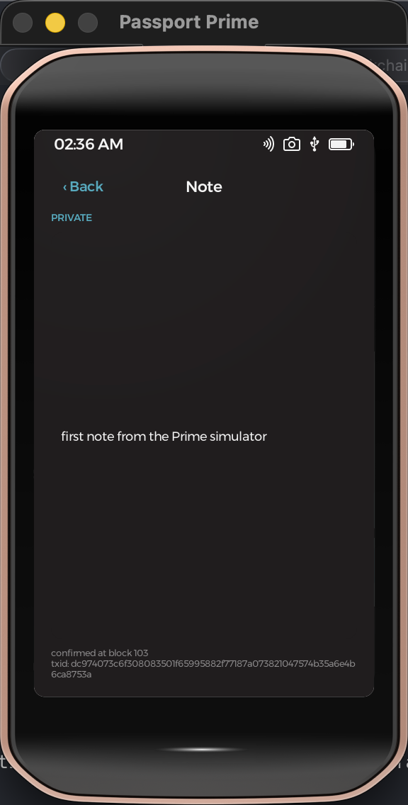
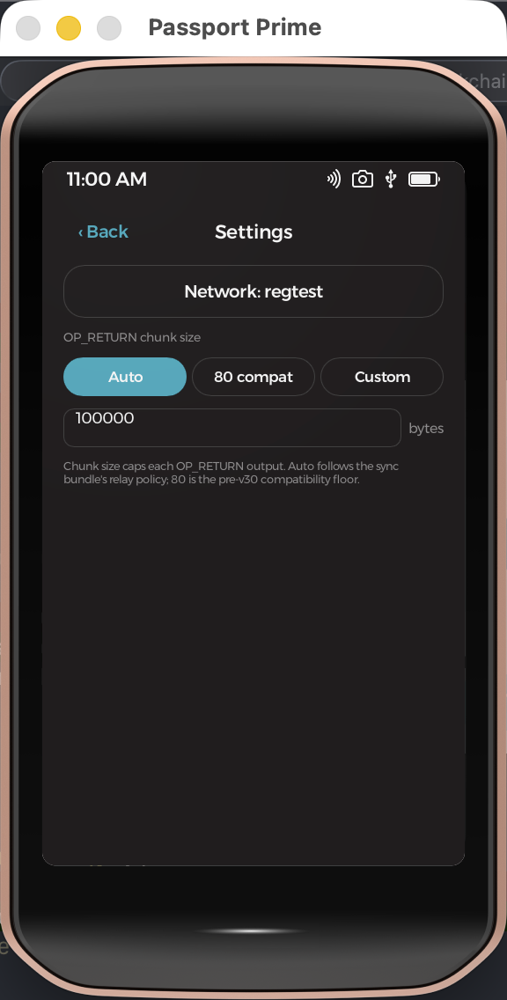
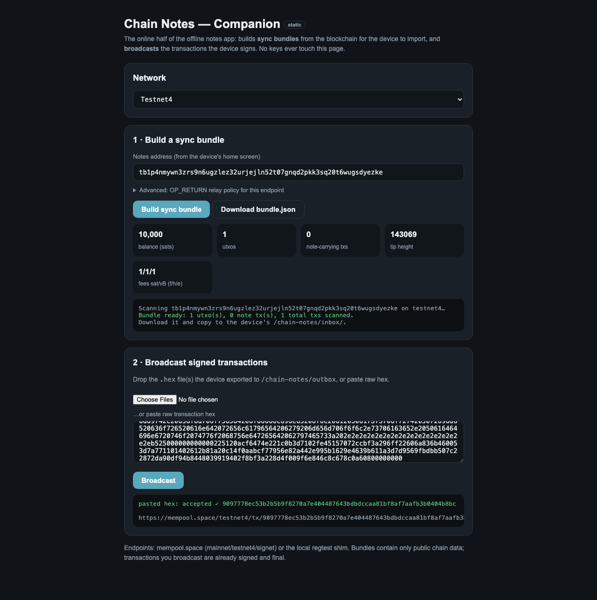

#  Chain Notes — a Passport Prime app

**Personal notes on the bitcoin blockchain**, from a device that has no
network on purpose. Compose text on Foundation's **Passport Prime**
(a Rust binary with a **Slint** UI on **KeyOS**), seal it with a key only
your device seed can re-derive — or leave it deliberately public — and the
app builds and signs a real bitcoin transaction carrying the note in
`OP_RETURN` outputs. An online companion broadcasts it and scans the chain;
the device and the companion exchange nothing but files/QRs: **sync
bundles** in, **signed transactions** out.

Your address history *is* the notebook: every note is a transaction from
the app's taproot address back to itself, timestamped by its block. Wipe
the device, restore the seed, rescan the chain — every note comes back,
private ones decrypted, with nothing stored anywhere else.

Notes can also be **sent to another address**: composing starts at a
**contacts picker** — yourself first, then recently-used addresses (auto-
saved, nameable), a QR scan, or manual entry. A directed note's tx pays
330 sats of dust to the recipient so their scanner finds it, and private
directed notes are sealed via **static-static x-only ECDH** against the
recipient's taproot key — only the two devices can read them, both
re-derivable from bare chain data after a wipe.
Anyone can send notes to any address (like email); received notes are
always attributed to their unforgeable input address and never mix with
your own. Privacy caveat: a directed note publicly and permanently links
the sender and recipient addresses on-chain.

<p align="center">
  
  &nbsp;
  
  &nbsp;
  
</p>
<p align="center">
  
  &nbsp;
  
</p>

## How it works

- **Identity**: one P2TR address, key HKDF-derived from `GetAppSeed`
  (the PIN-gated per-app seed — never the wallet's own accounts). The
  note-encryption key derives from the same root. Derivation strings are
  frozen forever; the wipe-recovery story depends on them.
- **A note** = tx spending the app's own coins: `OP_RETURN` payload(s) +
  change back to the same address. Private notes are XChaCha20-Poly1305
  sealed (nonce+tag once, then chunked); public notes are plaintext UTF-8.
  Envelope: `PNTE ‖ v1 ‖ flags ‖ note_id ‖ seq/total ‖ data`.
- **Sync bundle** (JSON via file or Airlock): UTXOs, fee tiers
  (mempool.space format), BTC price, tip height, the endpoint's
  `max_op_return_bytes` relay policy, and every OP_RETURN payload found in
  the address history. Only txs that *spend from* the notes address count
  — a third party paying the address with forged payloads is ignored, and
  private notes are additionally AEAD-authenticated.
- **Cost calculator**: the compose screen re-prices on every keystroke —
  pure arithmetic, no crypto runs (sealed size = text + 40 bytes, always).
  Fee tiers economy/normal/fast come from the bundle; a **Custom** tier
  engages automatically when you edit the sat/vB field. The estimate is
  byte-exact: tests assert it equals the signed transaction's real vsize.
- **Chunk size** (Settings, purely device-side): Standard is 100000 —
  Bitcoin Core v30's relay default, verified live on mempool.space — so
  typical notes are a single OP_RETURN; "80 compat" targets
  pre-v30/strict relays. If an endpoint rejects a note, the reason shows
  in the companion's broadcast log; pick 80 on the device and recompose.
- **Unconfirmed chaining**: signing updates a local UTXO ledger, so
  several notes can queue between syncs, each spending the last one's
  change.

## Layout

```
notes-core/     host-testable library: key derivation, envelope, AEAD,
                BIP341 sighash + BIP340 signing, tx assembly, sync bundles
src/ ui/        the KeyOS app (screens, persistence, log contract)
scripts/        regtest-e2e.sh (host e2e), regtest-companion.sh
vendor/         KeyOS getrandom TRNG override + security-api (GetAppSeed)
```

## Build & test

```bash
nix develop ~/.foundation/sdk/current --command cargo test -p notes-core
nix develop ~/.foundation/sdk/current --command bash scripts/regtest-e2e.sh
nix develop ~/.foundation/sdk/current --command foundation sim
../ui-automation/tests/chain-notes.sh    # full UI e2e (manages sim + bitcoind)
```

Fresh clone: recreate the SDK links the repo intentionally doesn't track
(`ln -s ~/.foundation/sdk/current/ui/ui ui/ui`, plus
`resources/{fonts,images}` symlinks + copied `icons/` — see NOTES.md), and
run `foundation sim` once to generate `manifest.toml`.

## What's verified

- `cargo test -p notes-core`: BIP340/BIP341 official vectors; addresses,
  txids, sighashes and signatures cross-checked against
  rust-bitcoin/libsecp256k1; envelope/AEAD round-trips; byte-exact fee
  estimator; spoof/foreign-seed rejection; idempotent imports.
- `scripts/regtest-e2e.sh` against Bitcoin Core v30: multi-chunk and
  323-byte single OP_RETURN notes relayed and mined; unconfirmed-change
  chaining; full-history wipe-restore; plaintext visible on-chain for
  public notes, ciphertext-only for private.
- `../ui-automation/tests/chain-notes.sh`: the same flow driven through
  the simulator UI with real taps/keystrokes — the tx signed on the
  "device" broadcasts on a real regtest node with the txid the device
  predicted, and a wiped app restores the note from bare chain data.

## The companion (`companion/`)

**Hosted: https://objsal.github.io/chain-notes-companion/** (deploy
mirror in the public `chain-notes-companion` repo, published via
`scripts/publish-companion.sh` — this directory is canonical).

The online half — one static page + an optional local server:

```bash
python3 companion/server.py 8091            # static (mainnet/testnet4/signet)
python3 companion/server.py 8091 --regtest  # + managed local regtest node
```

`index.html` builds **sync bundles** (full address-history pagination,
fee tiers, prices) shown as a downloadable file or as a **QR — static or
animated UR** — for the device's scanner, and **broadcasts** the
device's `.hex` exports or **scans the device's tx QR with the camera**;
all against mempool.space — or against a local regtest node that
`server.py` exposes through the *same mempool-shaped API*, so the page
treats regtest as just another base URL. The regtest option only appears
when the local server is detected. Playwright tests drive the real
rendered page: `tests/test_companion_regtest.py` (hermetic, incl. a
fake-camera scan), `tests/test_companion_qr.py` (bundle-QR round-trips
cross-checked against foundation-ur) and `tests/test_companion_testnet4.py`
(live), plus a no-network node unit test for the shared scan core
(`node tests/test_chain_scan.js`: cross-tx chunk reassembly, dedup,
partial surfacing, spoof rejection). Vendored: jsQR (Apache-2.0),
qrcode-generator (MIT), plus the hand-rolled `ur.js` UR encoder.

`viewer.html` is a read-only sibling page that renders an address's
on-chain notes directly in the browser (deep-linkable via
`viewer.html?address=…&network=…`; the bundle section's "View on-chain
notes" button opens it prefilled): it ports the PNTE envelope
decode/reassemble to JS, enforces the same spends-from-self rule, shows
public notes as text and private ones as an encrypted placeholder —
decryption stays on the device by design. Every note card carries a
**permalink** to `note.html?address=…&network=…&note=<id>`, a single-note
page for sharing a link to just one note. The scanning/envelope/render
core shared by both pages lives in `chain-scan.js`.

**Relay policy, verified live (2026-07-05):** mempool.space/testnet4
accepted a 224-byte single OP_RETURN
([tx](https://mempool.space/testnet4/tx/9097778ec53b2b5b9f8270a7e404487643bdbdccaa81bf8af7aafb3b0404b8bc))
— Bitcoin Core v30 defaults — which is why the device's Standard chunk
size is 100000. Chunk size lives entirely in the device's Settings;
bundles carry no relay policy.

## Honest caveats

- Every note costs a real fee, forever, in public. Private notes hide
  content, not existence, size, or timing.
- QR sync is wired both ways, no cable needed: pending note → "Show tx
  QR" → companion camera → broadcast; and companion "Show as QR"
  (static or animated UR) → device "Scan bundle 📷" (the system scanner
  reassembles animated sequences itself). File/Airlock remains for
  restore-sized bundles and oversized txs.
- Experimental software that signs real spends: Foundation asks
  wallet-adjacent apps to pass their security review
  (hello@foundation.xyz) before mainnet use.

Design docs live in the workspace: `../PLAN-chain-notes.md` (this app) and
`../FUTURE-chain-chat.md` (the address-to-address messaging sibling that
reuses this core).
